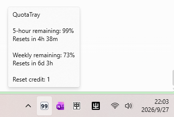

# QuotaTray

An unofficial Windows tray monitor for OpenAI Codex usage limits.

## Screenshot / What it shows



Normally the tray icon displays the 5-hour remaining percentage. When Weekly remaining falls below 10%, the tray switches to Weekly remaining and uses a red background with black text. At 10% or above it returns to the normal 5-hour display. Missing Weekly data does not trigger the warning state. Its tooltip shows 5-hour and weekly remaining quota, reset countdowns, reset credits, last refresh status, and stale or failure state.

## Features

- Reads quota through the local Codex App Server JSON-RPC method `account/rateLimits/read`.
- Stores quota snapshots locally to provide weekly history estimates.
- Offers refresh interval, Windows startup, and Codex executable path settings.
- Uses a per-user Windows tray app and installer.

## Requirements

- 64-bit Windows 10/11; the installer targets x64-compatible Windows.
- Microsoft Visual C++ Redistributable (x64), version 14.44 or newer. QuotaTray does not bundle its DLLs or install it. If missing, install it from [Microsoft's official x64 download](https://aka.ms/vc14/vc_redist.x64.exe), then rerun the QuotaTray installer.
- Install and sign in to OpenAI Codex as the same Windows user. QuotaTray does not include the Codex executable or a login flow.
- The QuotaTray installer is currently unsigned.
- QuotaTray starts the installed `codex.exe app-server --stdio` process and uses its authenticated session.

## Download and install

Download `QuotaTray-0.8.1-Setup.exe` from the [QuotaTray v0.8.1 GitHub Release](https://github.com/williamzhangww/QuotaTray/releases/tag/v0.8.1). The installer is per-user and does not require administrator rights. It is unsigned, so Windows SmartScreen may display a warning. Verify the installer against `SHA256SUMS.txt` from the same release before running it.

The installer is per user and installs to `%LOCALAPPDATA%\Programs\QuotaTray`. If an earlier QuotaTray version is registered in a different location, uninstall it first and then run the installer. The v0.8.1 clean namespace does not migrate data from earlier versions.

## How the tray number works

Normally the number is the 5-hour quota remaining percentage, not the percentage used. For example, if 78% is used, the icon shows `22`. Values are clamped from 0 to 100. When Weekly remaining is below 10%, the tray number switches to Weekly remaining and the icon uses a red background with black text. At 10% or above, it returns to the normal 5-hour display. Missing Weekly data does not trigger the warning state.

## Weekly exhausted behavior

When the weekly remaining quota reaches 0%, the tray icon shows `0` in the red-background, black-text warning state, and the tooltip hides the 5-hour block until weekly remaining becomes positive again. At 1–9%, the tray shows the Weekly percentage in the warning state while the tooltip continues to show both the 5-hour and Weekly blocks. When Weekly recovers to 10% or above, the tray returns to the normal 5-hour display and colors.

## Tooltip

The tooltip provides the current 5-hour and weekly remaining values, reset countdowns, refresh status, and available reset credits. If data is stale or refresh fails, it reports that state while retaining the last successful reading.

## Settings

Right-click the tray icon to refresh, open Settings, open the data folder, view About, or exit. Settings include refresh interval, optional Windows startup, and an optional `codex.exe` path.

## About

About QuotaTray shows the application version and the unofficial third-party relationship statement.

## Privacy and security

QuotaTray uses Codex App Server locally and requests `account/rateLimits/read`. It does not read or parse `auth.json`, inspect browser cookies, or copy credentials. It does not collect prompts, conversation text, source code, or user files. Quota history is stored locally and is not uploaded by QuotaTray. The application has no first-party telemetry, crash reporting, or update checker. Codex itself may make network requests as part of its normal operation.

The application reads quota data and does not mutate quota limits or execute reset credits. See [SECURITY.md](SECURITY.md) for security reporting.

## Local data

Settings, logs, and quota history are stored under:

```text
%LOCALAPPDATA%\QuotaTray\
  usage.db
  logs\app.log
  settings\settings.ini
```

This is the current QuotaTray data directory. Earlier versions used a different data directory; QuotaTray 0.8.1 does not read, move, or delete that data. If you want to keep using an earlier version, back up its data before uninstalling it.

## Uninstall

Uninstall QuotaTray from Windows Installed Apps / Apps & Features. The uninstaller removes program files, shortcuts, and its startup registration. It keeps `%LOCALAPPDATA%\QuotaTray` so history and settings remain; remove that folder yourself only if you also want to delete the local data.

## Troubleshooting

- If quota is unavailable, install and sign in to Codex under the same Windows account, then confirm `codex.exe` can be found. Use Settings to choose the executable if auto-detection fails.
- If the tray icon is hidden, enable it in Windows Taskbar system tray icon settings.
- If the installer is blocked or warns that its publisher is unknown, verify its SHA256 against `SHA256SUMS.txt` on the [v0.8.1 release page](https://github.com/williamzhangww/QuotaTray/releases/tag/v0.8.1).
- For security issues, follow [SECURITY.md](SECURITY.md).

## Verify SHA256

In PowerShell, compare the downloaded installer hash with the SHA256 value published on its GitHub Release page:

```powershell
(Get-FileHash .\QuotaTray-0.8.1-Setup.exe -Algorithm SHA256).Hash
```

The result should exactly match the release value.

## Build from source

Requirements: 64-bit Windows, Microsoft Visual C++ Redistributable (x64) 14.44 or newer, Python 3.10.11, PySide6 6.11.2, PyInstaller 6.22.3, and Inno Setup 7 (64-bit recommended). Install Inno Setup 7 with:

```powershell
winget install --id JRSoftware.InnoSetup.7 -e -s winget -i
```

The release script auto-detects an installed Inno Setup 7 compiler. Set `QUOTATRAY_ISCC` to the full path of `ISCC.exe` to select a specific compiler. From a PowerShell prompt in the cloned repository:

```powershell
python -m pip install -r requirements.txt
python -m pip install -e .
powershell -ExecutionPolicy Bypass -File tools\build_release.ps1
```

The release script requires Python 3.10.11 and an installed Inno Setup 7 compiler. It creates an onedir package and installer, verifies the frozen Qt/runtime payload, and writes SHA256 output under `release\`.

## License

QuotaTray source code is licensed under the MIT License; see [LICENSE](LICENSE).

## Third-party licenses

The Windows binary bundles third-party components. See [THIRD_PARTY_NOTICES.md](THIRD_PARTY_NOTICES.md) and `licenses/` for the runtime inventory, notices, attribution coverage, and license texts. Qt/PySide6 are dynamically linked and distributed as replaceable DLLs. The QuotaTray v0.8.1 GitHub Release provides the corresponding QtBase and Qt for Python source archives as release assets; their official Qt origins and SHA256 values are documented in `THIRD_PARTY_NOTICES.md`.

## Disclaimer

QuotaTray is an independent, unofficial third-party project. It is not affiliated with, endorsed by, or sponsored by OpenAI. OpenAI and Codex are referenced only to identify the compatible software and quota data source.
